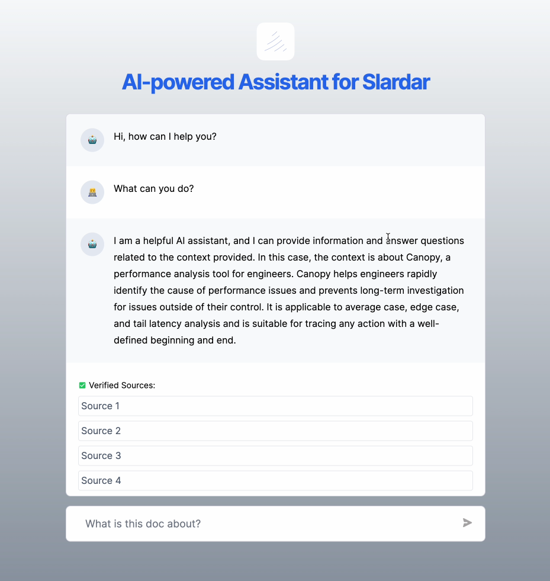

# GPT & LangChain Demo

Use the new GPT-\* api to build a chatGPT chatbot for multiple Large PDF files.

Tech stack used includes LangChain, Pinecone, Typescript, Openai, and Next.js.

[](preview/demo.mov)

## Development

1. Install dependencies

```
pnpm install
```

2. Set up your `.env` file

- Copy `.env.example` into `.env`
- Visit [openai](https://help.openai.com/en/articles/4936850-where-do-i-find-my-secret-api-key) to retrieve API keys and insert into your `.env` file.
- Visit [pinecone](https://pinecone.io/) to create and retrieve your API keys, and also retrieve your environment and index name from the dashboard.

3. In the `scripts/config` folder, replace the `PINECONE_NAME_SPACE` with a `namespace` where you'd like to store your embeddings on Pinecone when you run `pnpm run ingest`. This namespace will later be used for queries and retrieval.

4. In `utils/makechain.ts` chain change the `QA_PROMPT` for your own usecase. Change `modelName` in `new OpenAIChat` to `gpt-3.5-turbo`, if you don't have access to `gpt-4`. Please verify outside this repo that you have access to `gpt-4`, otherwise the application will not work with it.

## Embeddings

**This repo can load multiple PDF files**

1. Inside `docs` folder, add your pdf files or folders that contain pdf files.

2. Run the script `npm run ingest` to 'ingest' and embed your docs. If you run into errors troubleshoot below.

3. Check Pinecone dashboard to verify your namespace and vectors have been added.

## Start the application

First, run the development server:

```bash
npm run dev
# or
yarn dev
# or
pnpm dev
```

Open [http://localhost:3000](http://localhost:3000) with your browser to see the result.

## Troubleshooting

**General errors**

- Make sure you're running the latest Node version. Run `node -v`
- Try a different PDF or convert your PDF to text first. It's possible your PDF is corrupted, scanned, or requires OCR to convert to text.
- `Console.log` the `env` variables and make sure they are exposed.
- Make sure you're using the same versions of LangChain and Pinecone as this repo.
- Check that you've created an `.env` file that contains your valid (and working) API keys, environment and index name.
- If you change `modelName` in `OpenAIChat` note that the correct name of the alternative model is `gpt-3.5-turbo`
- Make sure you have access to `gpt-4` if you decide to use. Test your openAI keys outside the repo and make sure it works and that you have enough API credits.
- Check that you don't have multiple OPENAPI keys in your global environment. If you do, the local `env` file from the project will be overwritten by systems `env` variable.
- Try to hard code your API keys into the `process.env` variables.

**Pinecone errors**

- Make sure your pinecone dashboard `environment` and `index` matches the one in the `pinecone.ts` and `.env` files.
- Check that you've set the vector dimensions to `1536`.
- Make sure your pinecone namespace is in lowercase.
- Pinecone indexes of users on the Starter(free) plan are deleted after 7 days of inactivity. To prevent this, send an API request to Pinecone to reset the counter before 7 days.
- Retry from scratch with a new Pinecone project, index, and cloned repo.
